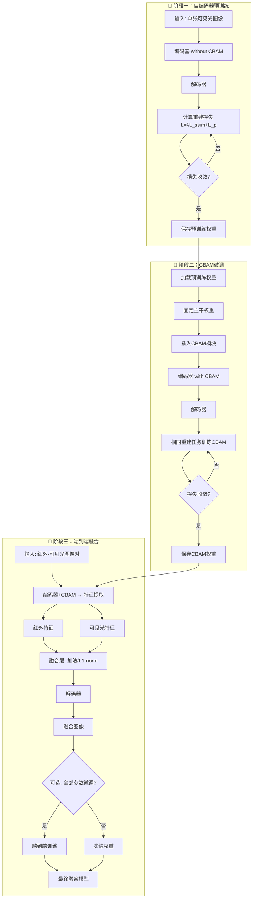
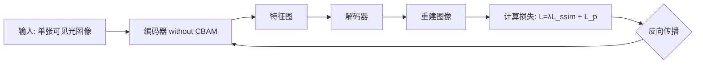
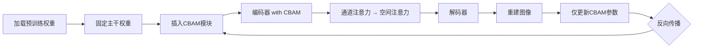
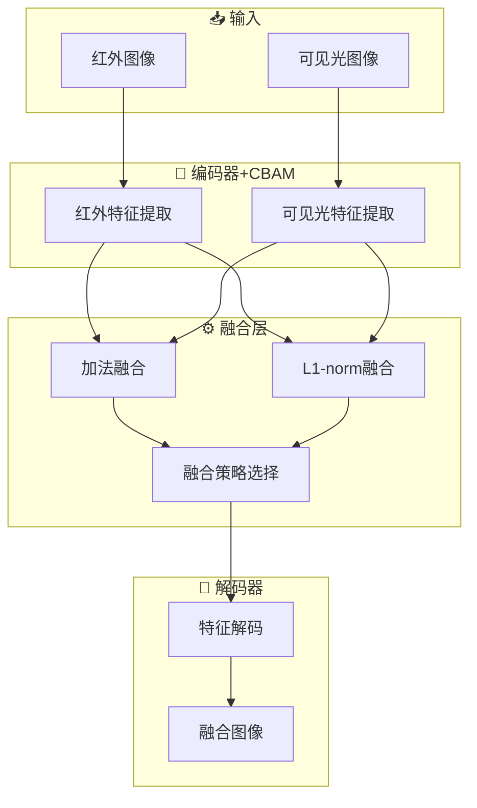
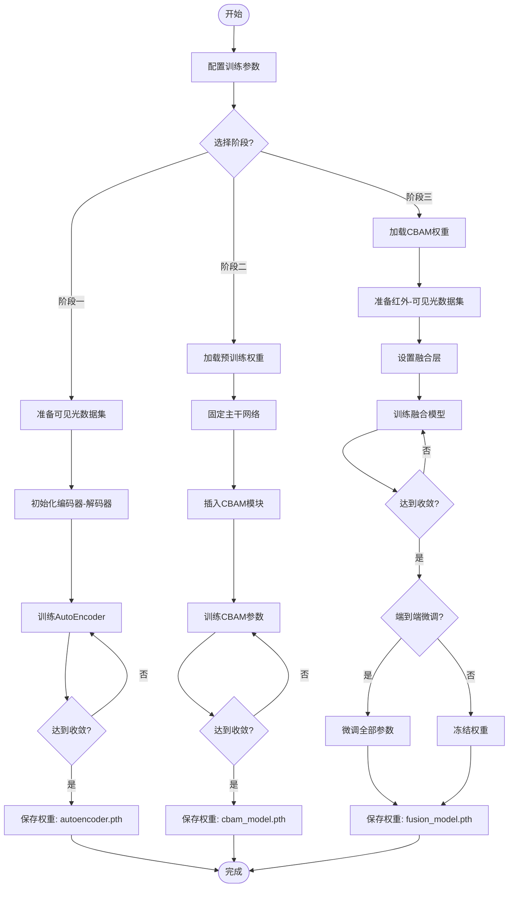

# 三阶段图像融合模型开发流程图

## 📊 总体流程图



---

## 🔬 详细技术流程

### 阶段一：自编码器预训练



#### 关键技术点

| 项目 | 说明 |
|------|------|
| **输入** | 单张可见光图像 (RGB) |
| **网络结构** | 编码器 + 解码器（无CBAM） |
| **损失函数** | L = λ × L_ssim + L_p |
| **训练目标** | 重构输入图像 |
| **输出权重** | 基础编码器-解码器预训练权重 |

#### 损失函数公式

$$L_{total} = \lambda \cdot L_{SSIM} + L_{pixel}$$

其中：
- $L_{SSIM}$: 结构相似性损失
- $L_{pixel}$: 像素级损失 (MSE/L1)
- $\lambda$: 平衡参数

---

### 阶段二：CBAM微调



#### CBAM模块结构

```
输入特征图
    ↓
[通道注意力]
    ├── 全局平均池化
    ├── 全局最大池化
    ├── 共享MLP
    └── Sigmoid激活
    ↓
[空间注意力]
    ├── 通道池化
    ├── 卷积层
    └── Sigmoid激活
    ↓
输出特征图
```

#### 关键技术点

| 项目 | 说明 |
|------|------|
| **加载权重** | 使用阶段一保存的预训练权重 |
| **固定参数** | 编码器和解码器权重冻结 |
| **可训练参数** | 仅CBAM模块参数 |
| **训练目标** | 学习通道和空间注意力 |

---

### 阶段三：端到端融合



#### 融合策略

```mermaid
graph LR
    A[特征1] --> ADD[加法融合]
    B[特征2] --> ADD
    A --> L1[L1-norm融合]
    B --> L1
    
    ADD --> O1[融合特征]
    L1 --> O1
    
    subgraph Energy["能量计算"]
        E1[能量1]
        E2[能量2]
        E1 --> W1[权重: E1/(E1+E2)]
        E2 --> W2[权重: E2/(E1+E2)]
        W1 --> F1[加权融合]
        W2 --> F1
    end
    
    L1 --> E1
    L1 --> E2
    F1 --> O2[融合特征]
```

---

## 📈 完整训练流程



---

## 🏗️ 网络架构详细图

### 阶段一：基础AutoEncoder

```
可见光图像 (H×W×3)
    ↓
┌─────────────────────────┐
│      编码器 (Encoder)     │
│  Conv → DenseBlock → Conv │
└─────────────────────────┘
    ↓
特征图 (H/8 × W/8 × 64)
    ↓
┌─────────────────────────┐
│      解码器 (Decoder)     │
│  Conv → DenseBlock → Conv │
└─────────────────────────┘
    ↓
重建图像 (H×W×3)
```

### 阶段二：集成CBAM

```
可见光图像 (H×W×3)
    ↓
┌─────────────────────────┐
│      编码器 (Encoder)     │
│  Conv → DenseBlock → Conv │
└─────────────────────────┘
    ↓
特征图 (H/8 × W/8 × 64)
    ↓
┌─────────────────────────┐
│    CBAM注意力模块        │
│  通道注意力 + 空间注意力   │
└─────────────────────────┘
    ↓
注意力特征图
    ↓
┌─────────────────────────┐
│      解码器 (Decoder)     │
│  Conv → DenseBlock → Conv │
└─────────────────────────┘
    ↓
重建图像 (H×W×3)
```

### 阶段三：红外-可见光融合

```
红外图像 ──────────────┐
(H×W×3)              │
    ↓                │
┌────────────────┐   │
│ 编码器+CBAM     │   │
└────────────────┘   │
    ↓                │
红外特征 ───────────┼──→ [融合层] → 解码器 → 融合图像
    │          │     │
可见光图像──┐    │
(H×W×3)  │    │
    ↓    │    │
┌────────────────┐ │
│ 编码器+CBAM     │ │
└────────────────┘ │
    ↓             │
可见光特征 ──────┘
```

---

## 📋 训练配置建议

| 阶段 | 批量大小 | 学习率 | Epochs | 备注 |
|------|---------|--------|--------|------|
| 阶段一 | 16-32 | 1e-4 | 50-100 | 重构预训练 |
| 阶段二 | 16-32 | 1e-4 | 20-50 | CBAM微调 |
| 阶段三 | 8-16 | 1e-5 | 30-80 | 融合训练 |

---

## 🎯 关键参数说明

| 参数 | 说明 | 推荐值 |
|------|------|--------|
| `λ_ssim` | SSIM损失权重 | 0.8-1.0 |
| `λ_pixel` | 像素损失权重 | 1.0 |
| `lr` | 初始学习率 | 1e-4 ~ 1e-5 |
| `weight_decay` | 权重衰减 | 1e-4 |
| `batch_size` | 批量大小 | 8-32 |

---

**更新时间**: 2026-03-26
**版本**: v1.0.0
**作者**: wokaka209
