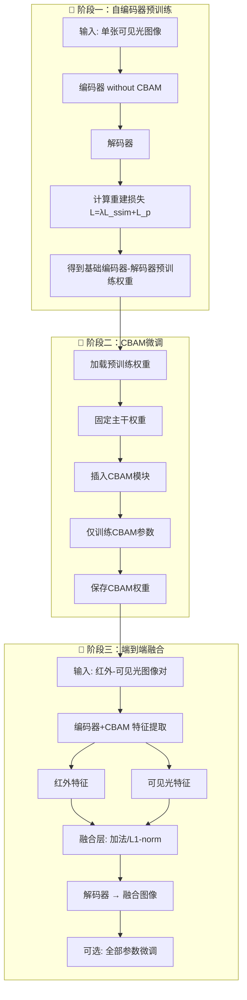
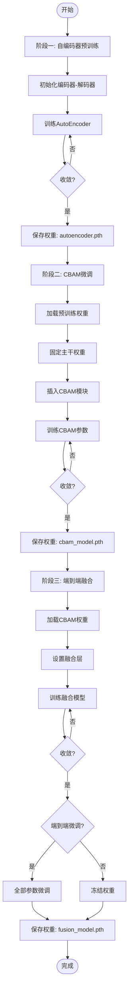

# 三阶段图像融合模型训练流程图

## 📊 总体流程



---

## 🔬 阶段一：自编码器预训练

```
输入: 单张可见光图像
    ↓
┌──────────────────────────────┐
│     编码器 (Encoder)         │
│  Conv → DenseBlock → Conv   │
└──────────────────────────────┘
    ↓
特征图 (H/8 × W/8 × 64)
    ↓
┌──────────────────────────────┐
│     解码器 (Decoder)         │
│  Conv → DenseBlock → Conv   │
└──────────────────────────────┘
    ↓
重建图像
    ↓
损失函数: L = λ × L_ssim + L_pixel
```

**训练目标**: 重构输入图像，学习基础特征表示

---

## 🔬 阶段二：CBAM微调

```
输入: 单张可见光图像
    ↓
┌──────────────────────────────┐
│     编码器 (Encoder)         │
│  Conv → DenseBlock → Conv   │
└──────────────────────────────┘
    ↓
特征图
    ↓
┌──────────────────────────────┐
│    CBAM 注意力模块           │
│  ┌────────────────────────┐ │
│  │    通道注意力          │ │
│  │  (Channel Attention)   │ │
│  └────────────────────────┘ │
│  ┌────────────────────────┐ │
│  │    空间注意力          │ │
│  │  (Spatial Attention)   │ │
│  └────────────────────────┘ │
└──────────────────────────────┘
    ↓
注意力增强特征图
    ↓
┌──────────────────────────────┐
│     解码器 (Decoder)         │
│  Conv → DenseBlock → Conv   │
└──────────────────────────────┘
    ↓
重建图像
```

**关键**: 固定编码器和解码器权重，仅训练CBAM模块

---

## 🔬 阶段三：端到端融合

```
红外图像                              可见光图像
    ↓                                    ↓
┌────────────────────────────┐  ┌────────────────────────────┐
│  编码器+CBAM              │  │  编码器+CBAM              │
│  (Encoder+CBAM)           │  │  (Encoder+CBAM)           │
└────────────────────────────┘  └────────────────────────────┘
    ↓                                    ↓
红外特征图                          可见光特征图
    ↓                                    ↓
    └────────────┬───────────────────────┘
                 ↓
    ┌────────────────────────────────────┐
    │         融合层 (Fusion Layer)        │
    │                                      │
    │  策略1: 加法融合                     │
    │    F = feature_ir + feature_vis      │
    │                                      │
    │  策略2: L1-norm融合                  │
    │    energy = |feature_ir| + |feature_vis|
    │    weight = energy / total           │
    │    F = weight × feature_ir + weight × feature_vis
    │                                      │
    └────────────────────────────────────┘
                 ↓
    ┌────────────────────────────┐
    │      解码器 (Decoder)       │
    └────────────────────────────┘
                 ↓
            融合图像
```

---

## 📈 完整训练流程



---

## 📋 训练配置对照表

| 阶段 | 输入数据 | 训练目标 | 可训练参数 | 训练轮数 |
|------|---------|---------|-----------|---------|
| **阶段一** | 可见光图像 | 重构损失 | 全部参数 | 50-100 epochs |
| **阶段二** | 可见光图像 | 重构损失 | 仅CBAM | 20-50 epochs |
| **阶段三** | 红外+可见光 | 融合损失 | 全部参数 | 30-80 epochs |

---

## 🔧 损失函数定义

### 阶段一&二：重构损失

$$L_{reconstruction} = \lambda_{ssim} \cdot L_{SSIM} + \lambda_{pixel} \cdot L_{pixel}$$

其中：
- $L_{SSIM}$: 结构相似性损失
- $L_{pixel}$: 像素级损失 (L1/MSE)
- $\lambda_{ssim}$: SSIM权重 (默认: 1.0)
- $\lambda_{pixel}$: 像素权重 (默认: 1.0)

### 阶段三：融合损失

$$L_{fusion} = \lambda_1 \cdot L_1 + \lambda_2 \cdot (1-SSIM) + \lambda_3 \cdot L_{grad} + \lambda_4 \cdot L_{TV}$$

其中：
- $L_1$: L1像素损失
- $SSIM$: 结构相似性
- $L_{grad}$: 梯度损失
- $L_{TV}$: Total Variation损失

---

**文档版本**: v1.0.0
**更新时间**: 2026-03-26
**作者**: wokaka209
